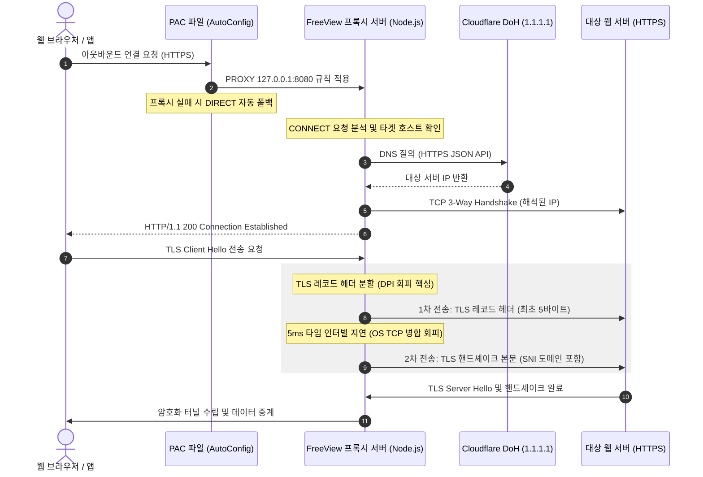

# FreeView

Windows 환경에서 심층 패킷 검사(DPI, Deep Packet Inspection) 및 SNI 기반 네트워크 차단을 우회하여 네트워크 접근성과 DNS 보안을 제공하는 유저스페이스 터널링 프로그램입니다.

가상 네트워크 어댑터(TUN/TAP) 또는 커널 드라이버를 로드하는 VPN 방식 대신, 유저스페이스 레벨의 비동기 TCP 루프백 프록시와 C# 네이티브 WinInet API 동기화 엔진을 결합하여 시스템 안정성을 확보하고 오버헤드를 줄인 것이 특징입니다.

---

## 주요 기능 (Key Features)

* **DPI 및 SNI 차단 우회**: TLS Client Hello 레코드의 헤더 분할 송신 기법을 통한 SNI 탐지 무력화.
* **PAC 기반 안전한 프록시**: PAC(Proxy Auto-Configuration) 파일의 `PROXY …; DIRECT` 폴백을 활용하여 프록시 장애 시에도 인터넷 연결 보장.
* **프록시 내부 DoH (DNS over HTTPS)**: OS의 DNS 설정을 변경하지 않고 프록시 내부에서 Cloudflare DoH(`1.1.1.1`)를 사용하여 DNS 해석. 사내망 및 로컬 DNS 호환성 완전 보존.
* **시스템 프록시 즉시 동기화**: C# 네이티브 WinInet 동기화 모듈(`refresh-proxy.exe`)을 통해 시스템 전역에 즉각 적용.
* **전방위 비정상 종료 방어**: `before-quit`, `will-quit`, `powerMonitor`(시스템 종료/절전), `uncaughtException`, `unhandledRejection`, `SIGINT/SIGTERM`, `process.exit` 등 모든 종료 경로에서 프록시 설정을 자동 롤백.
* **시작 시 자가 복구 (Self-Healing)**: 이전 세션의 비정상 종료 감지 시, PAC/프록시 잔여물을 자동 정리하여 인터넷 연결 즉시 복구.
* **포트 충돌 해소**: 8080 포트 점유 충돌 발생 시, `netstat` 조회를 통해 점유 중인 타 프로세스를 탐지하고 이를 자동 해제 후 기동.
* **백그라운드 최소화**: 윈도우 시스템 트레이 축소 및 컨텍스트 제어 지원.

---

## 작동 원리 및 상세 기술 명세 (How It Works & Technical Specifications)

FreeView는 네트워크 어댑터를 직접 변조하거나 암호화 오버헤드를 유발하는 방식 대신, 로컬 파이프라인에서 패킷 스트림의 전송 타이밍을 정밀하게 제어하여 차단을 우회합니다.

### 1. PAC 프록시 및 HTTP CONNECT 터널링 구조

1. FreeView는 앱 시작 시 PAC(Proxy Auto-Configuration) 파일을 로컬에 동적으로 생성합니다. PAC 파일은 `PROXY 127.0.0.1:8080; DIRECT` 규칙을 포함하여, 프록시가 응답하지 않을 경우 자동으로 직접 연결(DIRECT)로 폴백합니다.
2. 생성된 PAC 파일의 `file:///` URL이 윈도우 레지스트리의 `AutoConfigURL`에 등록되며, C# 네이티브 모듈이 WinInet API를 호출하여 모든 브라우저에 즉시 반영합니다.
3. 웹 브라우저나 시스템 애플리케이션이 아웃바운드 HTTPS 연결을 시도할 때, PAC 규칙에 따라 로컬 루프백 프록시(`127.0.0.1:8080`)로 트래픽이 라우팅됩니다.
4. FreeView 내부의 Node.js 기반 TCP 프록시 서버는 브라우저가 송신한 `CONNECT host:port HTTP/1.1` 요청을 수신합니다.
5. 프록시 서버는 **DoH(DNS over HTTPS)**를 통해 대상 호스트의 IP를 자체 해석한 뒤 TCP 연결을 수립하고, 클라이언트에 `HTTP/1.1 200 Connection Established`를 반환하여 양방향 데이터 중계를 시작합니다.



### 2. TLS 레코드 단편화 및 SNI 차단 우회 메커니즘
DPI(Deep Packet Inspection) 검열 장비는 주로 TLS 핸드셰이크의 첫 번째 패킷인 `Client Hello` 내부의 평문 SNI(Server Name Indication) 확장 영역을 파싱하여 차단 대상 도메인 유무를 식별합니다. FreeView는 다음과 같은 단계로 이를 우회합니다.

#### A. TLS 레코드 헤더(Record Header) 분리
* TLS 프레임워크의 레코드 레이어는 항상 고정된 **5바이트** 헤더로 시작합니다.
  - `ContentType` (1바이트, Handshake의 경우 `0x16`)
  - `ProtocolVersion` (2바이트, TLS 1.0은 `0x03 0x01`, TLS 1.2는 `0x03 0x03` 등)
  - `Length` (2바이트, 뒤따르는 페이로드의 크기)
* FreeView는 TCP 세션 시작 직후 최초로 유입되는 업스트림 데이터 스트림(`Client Hello`)을 가로챈 뒤, 이를 정확히 최초 5바이트(레코드 헤더)와 나머지 바이트(실제 Handshake 페이로드 및 SNI 정보 포함)로 이분할합니다.

#### B. TCP 결합(Coalescing) 무력화 지연 시간 적용
* OS의 TCP 스택은 성능 최적화를 위해 작은 크기의 TCP 페이로드들을 하나의 큰 IP 패킷으로 묶어서 보내려 시도합니다(Nagle 알고리즘 및 TCP Coalescing).
* 단순히 데이터를 나누어 호출(`Socket.write`)하더라도 두 호출 간 지연이 없다면 OS 커널 레벨에서 단일 세그먼트로 결합하여 단일 IP 패킷으로 송신되므로 DPI 검열 장비에 SNI가 고스란히 유출됩니다.
* FreeView는 최초 5바이트를 대상 소켓에 라이팅한 직후, 소켓 읽기를 일시 중단(`pause`)하고 **5ms 동안 전송 지연(Timeout)**을 강제 부여합니다.
* 이 5ms의 지연 시간은 OS 커널이 5바이트 세그먼트를 버퍼링하지 않고 즉시 별도의 IP 패킷으로 물리 송출(Flush)하도록 강제하는 임계값 역할을 합니다.

#### C. 페이로드 전송 및 DPI 우회
* 지연이 끝난 후, 실제 SNI 평문 정보가 들어 있는 나머지 Handshake 데이터를 전송합니다.
* 결과적으로 TLS 연결 수립을 위한 데이터는 2개의 상이한 TCP 세그먼트(헤더 패킷 / 바디 패킷)로 나뉘어 타겟 서버로 전송됩니다.
* DPI 검열 장비는 단일 패킷 관점의 단순 정적 시그니처 매칭 방식을 사용하므로, 패킷이 쪼개져 첫 패킷에 SNI 정보가 없고 두 번째 패킷에 유효한 TLS 헤더가 결합되어 있지 않으면 검열을 수행하지 못합니다.
* 대규모 네트워크 트래픽을 실시간으로 감시하는 방화벽 장비는 연산 오버헤드 한계로 인해 모든 TCP 세션에 대한 완전한 세션 재조립(Stateful TCP Stream Reassembly)을 수행하기 어렵다는 취약점을 이용한 방식입니다.

### 3. DNS over HTTPS (DoH) 내부 해석
* 기존의 `netsh` 명령을 통한 OS 네트워크 어댑터 DNS 변경 방식을 완전히 대체합니다.
* 프록시 서버가 `CONNECT host:port` 요청을 수신하면, OS의 `getaddrinfo`에 의존하지 않고 Cloudflare DoH(`https://1.1.1.1/dns-query`)에 HTTPS JSON API로 A 레코드를 질의합니다.
* **로컬/내부 도메인 보호**: `.local`, `.internal`, `.corp`, `.lan` 등 내부 도메인과 단일 라벨 호스트명은 DoH를 우회하여 OS 기본 DNS로 해석합니다. 이를 통해 사내망 접속 호환성을 완전히 보장합니다.
* **TTL 기반 캐시**: 해석된 DNS 결과를 메모리 캐시에 보관(60초~600초)하여 동일 도메인에 대한 반복 질의를 방지합니다.
* **자동 폴백**: DoH 서버 응답 실패, 타임아웃, 파싱 오류 등 모든 예외 상황에서 hostname을 그대로 반환하여 Node.js가 OS DNS를 통해 자동으로 해석합니다.

### 4. C# 네이티브 WinInet API 즉시 동기화
* 일반적으로 윈도우 레지스트리(`HKCU\Software\Microsoft\Windows\CurrentVersion\Internet Settings`) 내의 프록시 값만 변경하면 기존에 열려 있던 웹 브라우저(Edge, Chrome 등)나 백그라운드 프로세스는 프록시 정책 변경 사실을 인지하지 못합니다.
* FreeView는 C#으로 구현된 `refresh-proxy.exe`를 통해 윈도우의 `wininet.dll` API인 `InternetSetOption`을 다음과 같이 직접 호출합니다.
  - `InternetSetOption(IntPtr.Zero, INTERNET_OPTION_SETTINGS_CHANGED, IntPtr.Zero, 0)`
  - `InternetSetOption(IntPtr.Zero, INTERNET_OPTION_REFRESH, IntPtr.Zero, 0)`
* 이로 인해 레지스트리에 기록된 PAC URL 및 프록시 설정이 커널 캐시 및 모든 인터넷 세션에 즉시 반영되며, 브라우저 새로고침이나 별도의 지연 없이 약 5ms 내에 동기화가 완료됩니다.

### 5. 전방위 Lifecycle 방어 체계
비정상 종료(V8 크래시, 작업 관리자 강제 종료, 시스템 셧다운 등)로 인한 프록시 설정 잔류를 원천 차단합니다.

| 이벤트 | 동작 |
| :--- | :--- |
| `app.on('before-quit')` | 프록시 설정 동기식 롤백 + 상태 저장 |
| `app.on('will-quit')` | 이중 안전장치 (idempotent) |
| `process.on('exit')` | 최후의 방어선 |
| `process.on('SIGINT/SIGTERM')` | 터미널 종료 신호 처리 |
| `process.on('uncaughtException')` | V8 크래시 시 긴급 복구 |
| `process.on('unhandledRejection')` | Promise 오류 시 복구 |
| `powerMonitor.on('shutdown')` | 시스템 종료 시 긴급 롤백 |
| 시작 시 자가 복구 | 이전 세션 비정상 종료 감지 시 PAC/프록시 잔여물 자동 정리 |

또한 PAC의 `DIRECT` 폴백 덕분에, 만약 모든 방어가 실패하더라도 프록시 포트(8080)가 죽으면 브라우저가 자동으로 직접 연결을 사용합니다.

---

## 프로젝트 구조 (Project Structure)

```
├── main.js                 # Electron 메인 프로세스 (PAC 프록시 + DoH DNS + Lifecycle 방어)
├── preload.js              # IPC Bridge (렌더러-메인 보안 컨텍스트 정의)
├── refresh-proxy.exe       # C# WinInet API 동기화 네이티브 모듈
├── RefreshProxy.cs         # refresh-proxy.exe C# 소스 코드
├── index.html              # 렌더러 엔트리 페이지
├── package.json            # 프로젝트 메타데이터 및 빌드 설정
├── src/
│   ├── main.tsx            # React 진입점
│   ├── App.tsx             # 렌더러 컴포넌트 (트레이 상태 모니터링, 로그 및 테마 제어)
│   ├── index.css           # UI 스타일시트
│   └── utils/
│       └── exportZip.ts    # 소스 아카이빙 패키징 유틸리티
└── tsconfig.json           # TypeScript 빌드 구성
```

---

## 기술 스택 (Tech Stack)

| 구분 | 기술 | 버전 | 상세 역할 |
| :--- | :--- | :--- | :--- |
| **Runtime** | Electron | ^34.0.0 | 크로스 플랫폼 데스크톱 쉘 환경 구성 및 Node.js API 결합 |
| **Frontend** | React | ^19.0.1 | 컴포넌트 단위 선언식 UI 구현 |
| **Build Tool** | Vite | ^6.2.3 | 개발 HMR 제공 및 프로덕션 번들 최적화 |
| **Language** | TypeScript | ~5.8.2 | 프론트엔드 모듈 타입 안전성 확보 |
| **System Interop** | C# (WinInet) | - | Native DllImport를 이용한 WinInet 옵션 상태 강제 동기화 |
| **DNS** | DNS over HTTPS | - | Cloudflare DoH를 통한 프록시 내부 DNS 자체 해석 |

---

## 다운로드 및 설치 (Download & Installation)

### 1. 릴리즈 버전 실행
1. [GitHub Releases 공식 다운로드 페이지](https://github.com/qpi-labels/freeview-sni/releases)로 이동합니다.
2. 최신 버전의 **`FreeView Setup 2.0.0.exe`**를 확보합니다.
3. 시스템 수준의 프록시 레지스트리 수정을 위해 관리자 권한(UAC)을 승인해 주셔야 합니다.

> [!NOTE]
> FreeView 2.0부터는 `netsh` 명령을 통한 OS DNS 변경을 수행하지 않습니다. 프록시 내부에서 DoH를 통해 DNS를 자체 해석하므로 사내망/로컬 DNS 설정이 보존됩니다.

### 2. 개발자 소스 빌드

로컬 환경에서 소스 코드를 설치하고 구동하기 위한 세부 단계입니다.

```bash
# 의존성 모듈 설치
npm install

# 로컬 개발용 Vite 서버 구동 및 Electron 인스턴스 핫 리로드 실행
npm run electron:dev

# 배포 패키지 빌드 (dist-electron 내 인스톨러 생성)
npm run electron:build
```

#### C# 네이티브 모듈 빌드 (선택)
`refresh-proxy.exe`의 소스 코드(`RefreshProxy.cs`)가 제공됩니다. 바이너리를 직접 빌드하려면:

```bash
# Developer Command Prompt 또는 dotnet CLI
csc /target:exe /out:refresh-proxy.exe RefreshProxy.cs
```

#### 배포용 소스 아카이빙
`.git` 폴더 및 불필요한 캐시, 무시 대상 파일을 제외하고 원격 저장소(`origin`) 상태만을 준수한 압축 패키지를 빌드하는 명령어입니다.
```bash
npm run pack:source
```
* 수행 시 프로젝트 루트 경로에 배포용 `freeview-source.zip`이 구성됩니다.

---

## 트러블슈팅 및 비상 대책 (Troubleshooting)

### Q1. 정상적이지 않은 프로세스 종료 후 인터넷 연결이 끊겼습니다.
* **원인**: PAC 프록시 설정(`AutoConfigURL`)이 레지스트리에 남아있고, 해당 PAC 파일이 삭제되었기 때문입니다.
* **해결 방법**: **FreeView를 다시 한번 실행해 주십시오.** 시작 단계에서 이전 실행 상태의 무결성을 검증하고, 비정상 기록 감사 시 레지스트리의 PAC 설정과 잔여 파일을 자동 정리하는 자가 치유(Self-Healing) 시스템이 자동 동작합니다.
* **수동 복구 방법**: PowerShell(관리자 권한)에 다음의 명령어를 구동하여 수동 초기화할 수 있습니다:
  ```powershell
  # 1. PAC AutoConfigURL 레지스트리 키 삭제
  reg delete "HKCU\Software\Microsoft\Windows\CurrentVersion\Internet Settings" /v AutoConfigURL /f
  # 2. 수동 프록시 비활성화
  reg add "HKCU\Software\Microsoft\Windows\CurrentVersion\Internet Settings" /v ProxyEnable /t REG_DWORD /d 0 /f
  ```

> [!TIP]
> PAC의 `PROXY …; DIRECT` 폴백 덕분에, 프록시 포트(8080)가 죽어있어도 브라우저가 자동으로 직접 연결을 사용합니다. 따라서 이전 버전과 달리 비정상 종료 시 인터넷이 완전히 차단되는 상황이 원천적으로 방지됩니다.

### Q2. 8080 포트 바인딩 실패 에러가 발생합니다.
* **원인**: `EADDRINUSE` 오류로 타 로컬 웹 서버 등이 이미 8080 포트를 대기 상태로 설정하고 있어 중복 바인딩이 되지 않는 현상입니다.
* **해결 방법**: FreeView는 기동 시 포트 충돌이 확인되면 즉시 `netstat`을 이용해 대상 포트를 점유하고 있는 타 프로세스의 PID를 검출하고 `taskkill`을 실행하여 포트를 동적으로 회수합니다.

### Q3. 사내망 접속이 안 됩니다.
* **원인**: 내부 도메인(`.local`, `.corp`, `.internal` 등)이 DoH를 통해 해석되어 외부 DNS에서 찾을 수 없는 경우입니다.
* **해결 방법**: FreeView는 내부 도메인 패턴(`.local`, `.corp`, `.internal`, `.lan`, `.home`, `.intranet`, 점이 없는 단일 라벨 호스트명 등)을 자동으로 감지하여 DoH를 우회하고 OS 기본 DNS로 해석합니다. 만약 특수한 내부 도메인이 누락된 경우 `main.js`의 `DOH_LOCAL_SUFFIXES` 배열에 추가해 주십시오.

---

## 라이선스 및 기여 (Contributing & License)

* **License**: Copyright © 2024 - 2026 QuarterPi. All rights reserved.
* 본 프로젝트는 오픈소스 유틸리티 프로젝트로 기여를 환영합니다. 코드 개선 및 버그 제보는 Pull Request 및 Issue 탭을 사용해 주시기 바랍니다.
* 승인되지 않은 바이너리 파일의 상업적 재배포 및 악성 페이로드 주입 후 배포 행위는 엄격히 금지됩니다.
